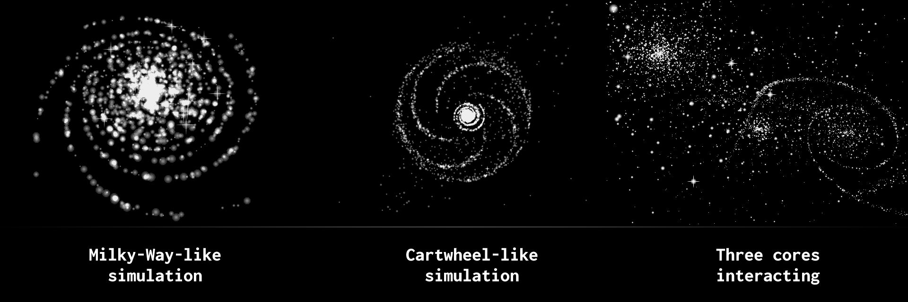

# Starways

A gravity simulator for MS-DOS. You can play it in the browser on the [Internet Archive](https://archive.org/details/msdos_starways_shareware#).

The description provided on [80.style](https://80.style/#/hsp/worthy_relics/starways) is reproduced here with minimal editing.

## What is it?

  Starways is a gravitational simulator, geared towards an
  interactive approximation of the evolution of collisions
  between galaxies. It approximates the attracting mass of
  a whole galaxy's core using a single, central attractor,
  presumably a black hole, plus the stars forming the core,
  then computes gravity from that point to all surrounding
  stars.

  Star masses are ignored, allowing for fast, real-time,
  zoomable simulations. In case studies, star masses
  have proven almost uninfluential for the final result of
  such a simulation - normally, adding effective masses to
  single stars determines the formation of clusters, which
  rarely influence the outline of the interactions between
  galaxies as a whole, and in view of an experiment geared
  to recreate the outlines of observed irregular galaxies,
  fine structures often do not matter that much.

## History

  Starways was created in 1997, written in Borland C++ 3.1
  for DOS (although calculations are highly optimized, and
  written in X387+ FPU assembly language), and in italian.
  In September 1998 it was quite appreciated and published
  in the "software corner" of a italian astronomy magazine
  (Nuovo Orione), and, well, shortly after, some copies of
  its italian version were even sold for the equivalent of
  about 12 US$. In February 2003, it was partly translated
  to english (program's text strings only, comments in the
  code still in italian).

## Source code

  The source code is included with
  the program's ZIP (starways.cpp being the "main" source,
  with assembly.h being a necessary header file). Starways
  has brief online instructions, and although it **will** take
  some practice it **might** be considerably intuitive to use;
  because of this - and because I have actually no time to
  write a user guide in english - the "online" help is all
  you have. But really, it might be sufficient.

## Features

  Starways can save and reload simulations (as files given
  the .SIM extension) and a few example files are included
  in the above archive. One additional feature of Starways
  is the ability to save pictures, out of simulations: the
  pictures try to imitate how the simulated galaxies would
  appear in a camera equipped with a CCD sensor. In short,
  the program "accumulates" light from each star on such a
  virtual CCD matrix, resulting in images which brightness
  depend on focus and exposure time.
